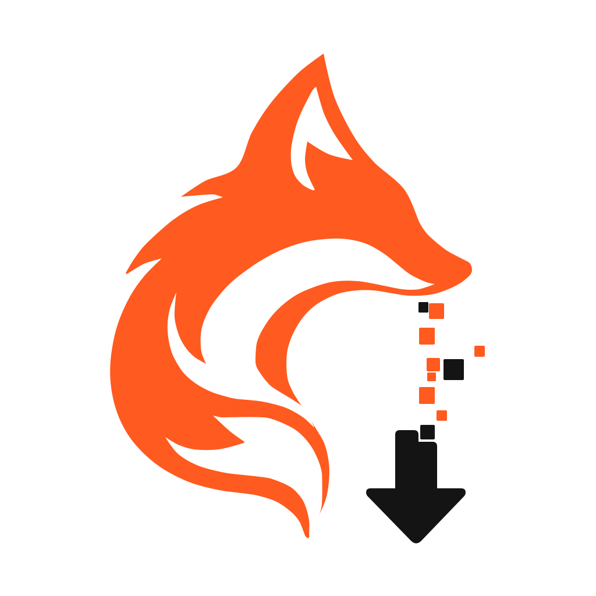

<p align="center">
  <picture>
    <source media="(prefers-color-scheme: dark)" srcset="public/icons/foxfetch-dark.svg">
    <source media="(prefers-color-scheme: light)" srcset="public/icons/foxfetch.svg">
    
  </picture>
</p>

# FoxFetch

适用于 Chrome 的网页媒体识别、播放控制与下载扩展，已支持 YouTube 和 Bilibili。

[English](README.md) | 简体中文

[下载 v1.0.2 Beta](https://github.com/IKITheFox/FoxFetch/releases/tag/v1.0.2-Beta) · [反馈问题](https://github.com/IKITheFox/FoxFetch/issues/new/choose) · [更新日志](CHANGELOG.md)

FoxFetch 基于 Manifest V3，将媒体资源侧边栏与浮动播放控制器整合在一起，用于识别受支持页面中的视频、音频和图片，并保存你拥有或获准下载的内容。

**当前状态：** v1.0.2 Beta，已在 GitHub 标记为 Latest。此版本通过 GitHub 分发，需要手动安装。版本名称仍保留 Beta；Latest 标记不代表已完成真实网站验收。

## v1.0.2 Beta 更新

- 大型内嵌图片正文不再写入会话资源列表和下载历史，为媒体识别与下载状态保留空间。
- 使用页面绑定的轻量引用，按需生成缩略图、读取原图下载。原图失效时需要刷新或重新扫描来源页面。
- 迁移旧内嵌图片记录，增加会话存储容量保护。
- 包含受限视口下的设置浮窗布局修复。保存或取消后底部仍留白属于已知后续问题，本版尚未修复。

验证情况：1900 项单元测试、4 项隔离浏览器测试、类型检查与生产构建通过。问题设备上真实登录网站的下载及合并输出仍待验收。详细变更和限制见[更新日志](CHANGELOG.md)。

## 功能

- **资源中心：** 查看当前页面的媒体资源，按名称搜索、按资源类型筛选。
- **播放控制器：** 播放与暂停、调整倍速、恢复默认速度、静音与解除静音；受支持的网站可切换上一或下一视频。
- **Bilibili 与 YouTube 下载：** 提供专用媒体识别和下载处理，实际可用资源取决于来源及账号权限。
- **YouTube 下载偏好：** 选择分辨率，并按兼容、画质或体积排序。发生适用的错误时，有限尝试其他格式组合，不静默降低所选分辨率。
- **本地媒体处理：** 在浏览器中合并受支持的音视频组合，通过临时存储处理较大的响应，无需额外安装桌面下载软件。
- **下载诊断：** 查看任务阶段、传输信息、保存结果和错误码。
- **界面设置：** 支持英文与简体中文、浅色／深色／跟随系统主题，以及可拖动的设置浮窗；关闭前提示保存未保存的更改。

## 安装

需要 **Chrome 120 或更高版本**，建议及时更新浏览器。其他 Chromium 浏览器可能无法支持 FoxFetch 使用的全部扩展接口。

### 方式一：直接拖入 ZIP

1. 打开 [v1.0.2 Beta 发布页](https://github.com/IKITheFox/FoxFetch/releases/tag/v1.0.2-Beta)，下载 **`FoxFetch-v1.0.2-Beta-chrome.zip`**。发布附件同时提供安装说明和用于完整性校验的 `SHA256SUMS.txt`。
2. 打开 `chrome://extensions/`，启用**开发者模式**。
3. 从文件管理器将 ZIP 拖入扩展管理页面。Chrome 会自动解压，无需手动解压。
4. 等待 FoxFetch 出现在扩展列表中，将其固定到工具栏，然后刷新媒体页面。

请拖入扩展管理页面，而不是普通网页。如果无法拖入或安装失败，请使用方式二。

### 方式二：解压后加载

1. 将安装 ZIP 解压到固定目录。
2. 打开 `chrome://extensions/`，启用**开发者模式**。
3. 选择**加载已解压的扩展程序**，指定解压后包含 `manifest.json` 的目录。
4. 将 FoxFetch 固定到工具栏，然后刷新媒体页面。

**使用期间请勿删除或移动解压目录。** 此要求仅适用于方式二，不适用于方式一使用的原始 ZIP。

项目源码包与第三方源码包供开发者使用，不是安装包。GitHub 自动生成的 **Source code** 下载也不能直接作为扩展加载。

### 更新

更新前请等待下载、捕获和合并任务结束，并记录需要保留的设置。重新加载会中断后台工作，并可能清除会话数据。

- **通过 ZIP 安装：** 下载新版安装 ZIP，开启开发者模式后拖入 `chrome://extensions/`。如果 Chrome 新增了一份扩展，请先停用旧版再使用新版；不要假定设置会在两份扩展之间自动迁移。
- **通过解压目录安装：** 备份安装目录，用新版解压文件替换目录内容，然后在 Chrome 扩展管理页点击**重新加载**。保持目录路径不变。

更新后刷新媒体页面，并仅启用一份 FoxFetch。这两种手动安装方式均不会在 GitHub 发布新版本后自动更新。

## 使用

1. 打开媒体页面，从工具栏选择 FoxFetch。
2. 在**资源中心**查看资源，或打开**控制器**操作当前播放器。
3. 选择可用的下载选项与保存位置，开始下载。
4. 等待文件保存成功的确认。下载进度不等于文件已经保存成功。

在功能需要时授予对应的网站访问权限。可拖动 Chrome 侧边栏边界调整宽度。

## 支持范围与限制

- 仅下载你拥有或已获授权下载的内容，并遵守适用法律、平台条款及内容许可。
- FoxFetch 不绕过 DRM、付费访问限制或服务端会话验证。能够播放不代表一定能够下载。
- 可用性取决于网站、媒体格式和浏览器，并非所有直播或编码／封装组合均受支持。
- 画质与体积偏好根据来源提供的元数据排序，不保证特定画质或最终文件大小。
- 高码率下载仍受可用磁盘空间、浏览器资源及服务端限制，不能仅凭分辨率判断下载是否能够完成。
- YouTube 要求会话验证时，任务会停止并显示错误，不会把不完整文件标记为下载成功。

## 隐私与权限

媒体在本机处理。资源识别和下载仍会与原网站或其媒体服务器通信。

部分设置可能通过浏览器同步。存储、网站访问权限及诊断信息的详情见[隐私与权限说明](docs/PRIVACY.zh-CN.md)。分享诊断信息前请移除私人内容。

## 开发

使用 `package.json` 声明的 **Node.js 24.15 及以上的 24.x 版本**与 **pnpm 11.19 及以上的 11.x 版本**。

```sh
git clone https://github.com/IKITheFox/FoxFetch.git
cd FoxFetch
pnpm install --frozen-lockfile
pnpm typecheck
pnpm test
pnpm build
```

构建后将 `.output/chrome-mv3` 加载为已解压的扩展程序。开发模式使用 `pnpm dev`。依赖补丁保存在 `patches/` 中，安装时自动应用。

自动检查包含类型检查、单元测试及生产构建，不能替代真实媒体页面上的下载与播放测试。

## 贡献与支持

- 提交 Pull Request 前请阅读[贡献指南](CONTRIBUTING.zh-CN.md)。
- 使用 [Issue 模板](https://github.com/IKITheFox/FoxFetch/issues/new/choose)反馈缺陷或提出功能建议。
- 安全漏洞请通过[安全政策](SECURITY.zh-CN.md)中的非公开渠道报告。
- 版本记录见[更新日志](CHANGELOG.md)。

## 许可证

Copyright © IKITheFox

采用 **GPL-3.0-only** 许可证，详见 [LICENSE](LICENSE) 和[版权与许可适用范围](COPYRIGHT.md)。

第三方组件保留原有许可证，详见[第三方说明](THIRD_PARTY_NOTICES.md)及[源码与构建说明](THIRD_PARTY_SOURCES.md)。

FoxFetch 与 Google、YouTube、Bilibili 等提及的平台提供方无隶属或背书关系。
